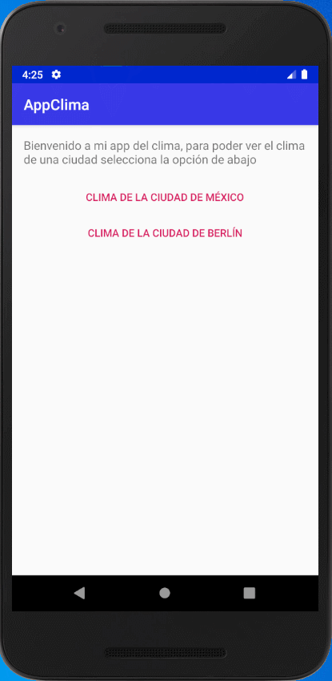

# Proyecto

<table border="0">
    <tr>
        <td></td>
        <td>Proyecto que es un pequeño ejemplo de uso de consume de peticiones HTTP en Kotlin</td>
    </tr>
</table>

## Observaciones

1. El proyecto se apoya con el uso de servicios externos, los cuales son:
    * OpenWeather. Plataforma que ofrece una api gratuita para el clima. [Página](https://openweathermap.org/).

2. Las librerías usadas son:

    * Volley: Librería que da facilidad de realizar peticiones HTTP:
        ~~~
        implementation 'com.android.volley:volley:1.1.0'
        ~~~

## Resultados

<table border="0">
    <tr>
        <td></td>
    </tr>
</table>